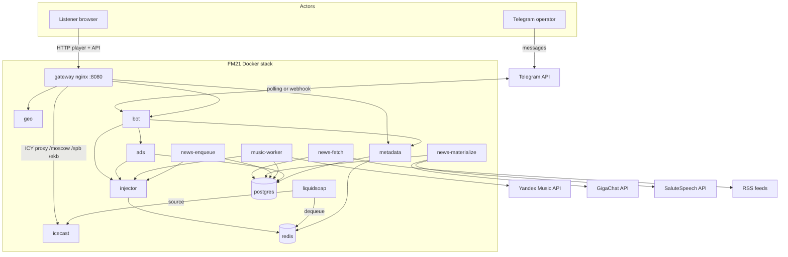
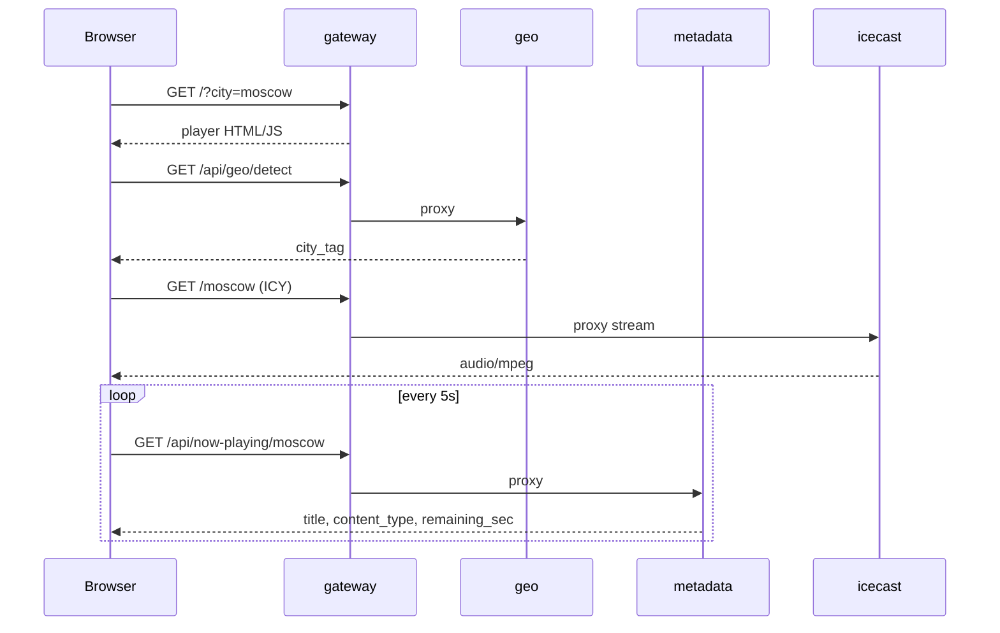
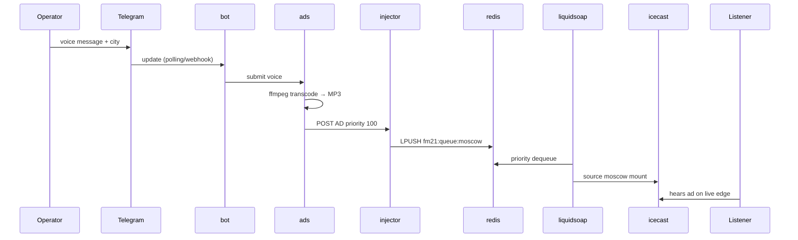
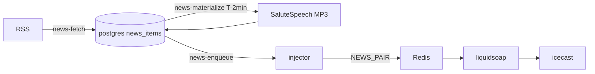
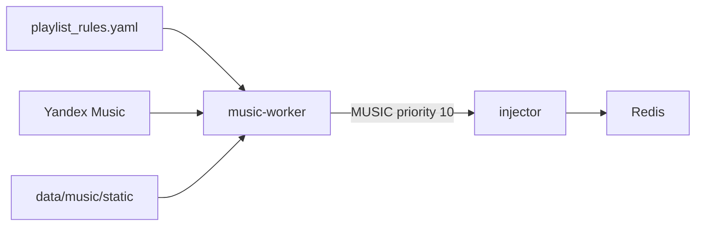

# FM21 — System architecture

High-level map of containers, data stores, and request flows. Behavior details live in `docs/contracts/`; deployment runbooks in [`deploy/README.md`](../deploy/README.md).

**Invariant:** one synchronous live timeline per `city_tag` (sync radio). Audio is server-side ICY; the web player does not stitch segments in the browser.

---

## System context

---

## Compose services

Dev stack: root `docker-compose.yml`. Production (local pet): [`deploy/production/docker-compose.prod.yml`](../deploy/production/docker-compose.prod.yml) — same images, baked configs, optional `cron` service.

| Service | Type | Role |
|---------|------|------|
| **gateway** | nginx | Public entry: static player (`web/`), reverse proxy to geo/metadata/bot, ICY mounts |
| **icecast** | C | Streaming server — one mount per active city |
| **liquidsoap** | C | Broadcast engine: priority dequeue, crossfade, NEWS_PAIR |
| **redis** | data | Queues `fm21:queue:{city}`, now-playing `fm21:current:{city}`, news slot pins |
| **postgres** | data | News, ads, tracks cache, playlist config, broadcast log |
| **db-migrate** | job | Schema migrations (runs once on startup) |
| **injector** | API | Internal enqueue API — sole writer to Redis queues |
| **geo** | API | City detection from IP / coordinates |
| **metadata** | API | Now-playing, queue preview, health |
| **bot** | API + worker | Telegram commands; long polling locally (`BOT_MODE=polling`) |
| **ads** | API | Voice ad transcode, persistence, enqueue AD |
| **music-worker** | worker | Keeps ≥ N MUSIC items per city (Yandex or static) |
| **news-fetch** | worker | RSS ingest → `news_items` |
| **news-materialize** | worker | Summarize + TTS ~2 min before slot |
| **news-enqueue** | worker | NEWS_PAIR every 15 min, fan-out all cities |
| **news-play-count-reset** | worker | Midnight UTC play-count reset |
| **cron** | worker | Prod only: PG cleanup (ads, tracks), news cache reset (TZ §9) |
| **test** / **e2e** | CI | pytest and agent-browser (not part of runtime stack) |

Active cities are defined in [`broadcast/liquidsoap/cities.yaml`](../broadcast/liquidsoap/cities.yaml) (currently `moscow`, `spb`, `ekb`). Liquidsoap spawns one output pipeline per entry — no code change per city.

---

## External HTTP surface (via gateway)

| Path | Backend | Purpose |
|------|---------|---------|
| `/` | static `web/` | Web player |
| `/moscow`, `/spb`, `/ekb` | icecast | ICY audio stream |
| `/api/geo/*` | geo | Geo detect / reverse |
| `/api/now-playing/{city}` | metadata | Current track metadata |
| `/api/queue/{city}` | metadata | Pending queue preview |
| `/api/health` | metadata | Public liveness (minimal) |
| `/api/bot/webhook` | bot | Telegram webhook (HTTPS only; optional) |

`/internal/health` on metadata is **not** exposed through gateway — deep checks (Redis, Postgres, Icecast, Liquidsoap) for operators on the container network.

---

## Queue and priority

Redis list per city: `fm21:queue:{cityTag}`.

Liquidsoap dequeues by priority (highest first):

| Type | Priority | Source |
|------|----------|--------|
| AD | 100 | ads service ← bot voice |
| MUSIC_ORDER | 50 | bot `/order` |
| MUSIC | 10 | music-worker buffer |
| NEWS_PAIR | (slot) | news-enqueue — stinger + news atomically |

Fan-out: enqueue with `city_tag: all` duplicates into every active city's queue (see [broadcast-semantics.md](contracts/broadcast-semantics.md)).

---

## Data flows

### Listener path

### Voice ad (operator)

### News slot (every 15 min)

Pipeline: RSS → GigaChat summary → TTS → materialize cron pins slot → enqueue cron fans out stinger+news to all cities.

### Music buffer

`MUSIC_PROVIDER=static` (default in dev) uses loop MP3s; `yandex` uses OAuth token from `.env`.

---

## Storage layout

| Store | Keys / tables | Written by | Read by |
|-------|---------------|------------|---------|
| Redis | `fm21:queue:{city}` | injector | liquidsoap, metadata |
| Redis | `fm21:current:{city}` | liquidsoap | metadata |
| Redis | `fm21:news:played:{hash}` | news workers | selection |
| Postgres | `news_items`, `ads`, `tracks_cache`, `playlist_config` | news, ads, music | workers, metadata |
| Volume `data/` | ads MP3, news audio, static music | ads, news TTS | liquidsoap (via HTTP/file URI) |

News audio S3 backend is stubbed (`services/news/storage/s3.py`); local filesystem is used.

---

## Related documents

| Document | Content |
|----------|---------|
| [broadcast-semantics.md](contracts/broadcast-semantics.md) | Queue JSON, NEWS_PAIR, fan-out |
| [listener-contract.md](contracts/listener-contract.md) | Player UX, geo, metadata polling |
| [operator-contract.md](contracts/operator-contract.md) | Bot commands, auth |
| [ADR-001 delivery](adr/001-delivery-model.md) | Sync radio, injector seam |
| [ADR-003 containers](adr/003-container-strategy.md) | Docker everywhere, Compose dev-only |
| [deploy/README.md](../deploy/README.md) | Prod compose, adding a city, smoke checklist |
| [docs/runbooks/stream-down.md](runbooks/stream-down.md) | Stream outage response |
