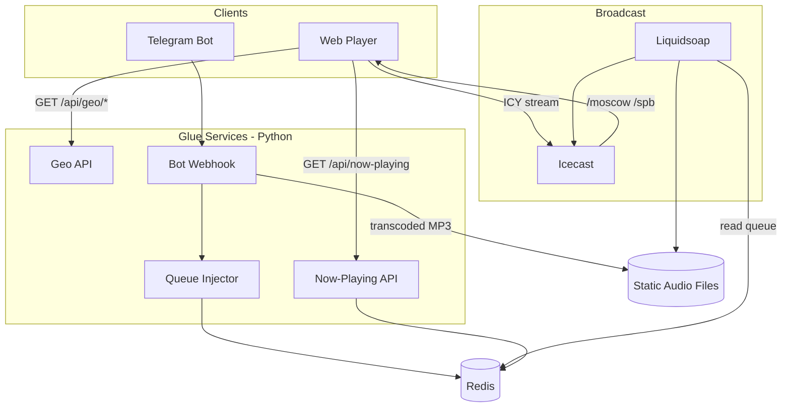

# Plan: FM21 Greenfield — Docs, Broadcast Spine, Geo Vertical Slice

## Summary

Establish FM21 as an agent-ready greenfield project: strategy and contract docs, ADRs, Liquidsoap+Icecast broadcast spine for two cities, a web player with geo detection, and a Telegram voice-ad pipeline that proves geotargeting before Yandex music, news, and TTS integrations.

---

## Problem Frame

`docs/brainstorms/2026-06-08-fm21-requirements.md` defines product behavior and pre-development gates, but the repo has no code, ADRs, contracts, or agent onboarding docs. `docs/tz.md` still embeds superseded implementation choices (Node broadcast engine, Web Audio stitching, HLS/WebSocket audio). Planning must deliver Phase 0 documentation and Phase 1 geo proof without re-litigating product behavior.

---

## Requirements

Carried from origin (see `docs/brainstorms/2026-06-08-fm21-requirements.md`):

**Pre-development:** R23–R34, R38–R39 (strategy, AGENTS.md, contracts, ADRs, acceptance spec, agent workflow gates, container strategy)

**Phase 1 product:** R1–R4, R9–R18, R35–R37 (geo, ads, listener UX, two-city proof)

**Deferred to later phases:** R5–R8, R19–R22 (full queue priorities, news cadence, bot orders, admin playlist)

---

## Key Technical Decisions

| ID | Decision | Rationale |
|----|----------|-----------|
| KTD-1 | **Liquidsoap + Icecast** as broadcast spine | Proven autonomous radio; native queue/crossfade; avoids custom muxer (see origin, ideation #2) |
| KTD-2 | **Synchronous ICY stream per `city_tag`** | Matches sync-radio decision; 2–5s latency; `<audio>` player; background-tab friendly (see origin AE5) |
| KTD-3 | **Metadata via HTTP poll**, not audio WebSocket | Separates playback from now-playing; audio survives metadata outage (see ideation inversion #8) |
| KTD-4 | **Redis list as enqueue bus** | Services LPUSH JSON items; Liquidsoap `request.dynamic` or sidecar poller feeds harbor; maps to `tz.md` §8.2 keys |
| KTD-5 | **Python 3.12** for glue services | Telegram ecosystem (`python-telegram-bot`), ffmpeg subprocess, fast iteration for solo+agents |
| KTD-6 | **Docker Compose for development only** | Root `docker-compose.yml` orchestrates full local stack; not used in staging/production (R39) |
| KTD-7 | **Phase 1 static music catalog** on disk/S3 | Proves geo before Yandex OAuth complexity (R35); Yandex adapter in Phase 2 |
| KTD-11 | **Docker images for all environments** | Every component (broadcast, glue, web, test runners) ships as an image; dev, CI, staging, prod run containers — no host Python/Node/ffmpeg (R38) |
| KTD-12 | **Monorepo** | Single repo: `broadcast/`, `services/`, `web/`, `docker/`, `deploy/`, `tests/` |
| KTD-8 | **`city_tag=all` → fan-out inject** | Same ad URI enqueued to every active city mount at AD priority (resolves flow gap FG1) |
| KTD-9 | **Stinger+news = atomic pair** in Phase 2+ | Nothing inserts between stinger and news; Phase 1 has no news |
| KTD-10 | **PostgreSQL deferred** to Phase 2+ | Phase 1 ads stored on filesystem; news persistence not needed yet |

---

## High-Level Technical Design



**Enqueue item shape (Redis JSON):**

```text
{
  "id": "uuid",
  "type": "AD" | "NEWS_PAIR" | "MUSIC_ORDER" | "MUSIC",
  "priority": 100 | 80 | 50 | 10,
  "uri": "file:///data/ads/xxx.mp3",
  "city_tag": "moscow" | "spb" | "all",
  "meta": { "title": "...", "artist": "...", "duration_sec": 45 }
}
```

**Mount naming:** `http://icecast:8000/moscow`, `http://icecast:8000/spb`

**City detection order (Listener Contract):** `?city=` → `localStorage` → geolocation → reverse geocode → IP GeoIP → default `moscow`

---

## Output Structure

```text
FM21/
├── AGENTS.md
├── STRATEGY.md
├── README.md
├── .env.example
├── docker-compose.yml          # development only (KTD-6)
├── docker/                     # Dockerfiles (shared bases + per-service)
├── deploy/                     # staging/production manifests (U11; not Compose)
├── broadcast/
│   ├── liquidsoap/
│   │   ├── fm21.liq              # parameterized script
│   │   └── cities.yaml           # active city_tag list
│   └── icecast/
│       └── icecast.xml
├── services/
│   ├── geo/                      # FastAPI geo detect + reverse
│   ├── bot/                      # Telegram webhook + voice handler
│   ├── metadata/                 # now-playing reader
│   └── injector/                 # Redis → Liquidsoap harbor bridge
├── web/
│   ├── index.html
│   ├── player.js
│   └── styles.css
├── data/
│   ├── music/static/             # Phase 1 MP3 bed
│   └── ads/                      # transcoded voice ads
├── docs/
│   ├── adr/
│   │   ├── 001-delivery-model.md
│   │   ├── 002-music-licensing.md
│   │   └── 003-container-strategy.md
│   ├── contracts/
│   │   ├── broadcast-semantics.md
│   │   ├── listener-contract.md
│   │   └── operator-contract.md
│   └── plans/                    # this file
├── spec/
│   └── acceptance.yaml
└── tests/
    ├── test_geo.py
    ├── test_injector.py
    └── e2e/geo-isolation.spec.ts  # agent-browser
```

---

## Phased Delivery

| Phase | Units | Outcome |
|-------|-------|---------|
| **0 — Docs & gates** | U1–U3 | Agent-ready repo; contracts; ADRs |
| **1 — Geo vertical slice** | U4–U8 | Two-city ICY streams; Moscow-only ad proof |
| **2 — Music (Yandex beta)** | U9 | OAuth proxy; MUSIC_ORDER; playlist rules |
| **3 — News** | U10 | Cron; TTS; 15-min slots; stinger+news pairs |
| **4 — Production hardening** | U11 | `deploy/` manifests; PostgreSQL; monitoring; multi-city ops (same images, no Compose) |

---

## Implementation Units

### U1. Strategy, AGENTS.md, and repo scaffolding

**Goal:** Agent onboarding and project identity before code.

**Requirements:** R23, R24, R28, R29

**Dependencies:** None

**Files:**
- `STRATEGY.md` (create)
- `AGENTS.md` (create)
- `README.md` (create)
- `.env.example` (create)
- `.gitignore` (modify — add `data/ads/*`, `.env`, `node_modules/`)

**Approach:**
- `STRATEGY.md`: problem (geotargeted autonomous radio), persona (city listeners + Telegram operators), metrics (active listeners/city, ad enqueue rate, stream uptime), tracks aligned to Phases 0–4
- `AGENTS.md` (~100 lines): read-first table → STRATEGY, contracts, ADRs, this plan, `spec/acceptance.yaml`; commands (`docker compose up`, test commands); human-only zones (ADRs, `.env`, secrets)
- `README.md`: one-paragraph product + quickstart pointer

**Test scenarios:**
- Test expectation: none — documentation unit

**Verification:** `AGENTS.md` links resolve; new agent session can orient without reading `docs/tz.md`

---

### U2. ADRs and behavior contracts

**Goal:** Pin architectural and behavioral decisions before broadcast code.

**Requirements:** R25, R32, R33, R34

**Dependencies:** U1

**Files:**
- `docs/adr/001-delivery-model.md` (create)
- `docs/adr/002-music-licensing.md` (create)
- `docs/adr/003-container-strategy.md` (exists — reference in ADR-001 appendix if needed)
- `docs/contracts/broadcast-semantics.md` (create)
- `docs/contracts/listener-contract.md` (create)
- `docs/contracts/operator-contract.md` (create)

**Approach:**
- ADR-001: sync multi-mount Icecast; ICY primary; Redis enqueue; stinger+news atomic; `all` fan-out; news waits behind ad backlog
- ADR-002: Yandex OAuth closed beta; production requires separate license; royalty-free fallback
- Broadcast Semantics: priority table, no-interrupt rule, block definitions, enqueue API reference
- Listener Contract: geo order, badge UX (no modal), city switch = immediate reconnect to live edge, late joiner hears remainder
- Operator Contract: voice ad city confirmation, 6th ad rejected, 60s limit, `/city` default

**Test scenarios:**
- Test expectation: none — documentation unit

**Verification:** Contracts cover flow-analysis gaps FG1–FG7; Liquidsoap queue semantics implementable from Broadcast Semantics (Redis consumption mechanism chosen in U4 per ADR-001 Appendix A)

---

### U3. Acceptance spec and API contracts

**Goal:** Machine-verifiable acceptance criteria for agents and CI.

**Requirements:** R26, R34

**Dependencies:** U2

**Files:**
- `spec/acceptance.yaml` (create)
- `docs/openapi.yaml` (create — geo + metadata endpoints only for Phase 1)

**Approach:**
- Port AE1–AE6 from origin plus new examples: ad queue full rejection, `all` fan-out, city switch reconnect
- OpenAPI: `GET /api/geo/detect`, `GET /api/geo/reverse`, `GET /api/now-playing/{cityTag}`, `GET /api/health`

**Test scenarios:**
- Covers AE1. Given moscow+spb streams live, when Moscow ad enqueued, then SPB stream unchanged
- Covers AE4. Given denied geolocation, when player loads, then badge shows with change control, Play available
- Covers AE6. Given active playback, when tab hidden 10 min, then audio continues

**Verification:** Each origin AE maps to at least one `spec/acceptance.yaml` entry with `covers: [R#]`

---

### U4. Docker dev stack — broadcast foundation

**Goal:** Runnable Liquidsoap + Icecast + Redis in the **development** Compose stack; establish Dockerfile pattern for all later units.

**Requirements:** R35 (partial), R38, R39

**Dependencies:** U2

**Files:**
- `docker-compose.yml` (create — **dev only**)
- `docker/liquidsoap.Dockerfile` (create)
- `docker/icecast.Dockerfile` (create — or use upstream image with mounted config)
- `docker/python.Dockerfile` (create — shared base for glue services U5–U8)
- `broadcast/icecast/icecast.xml` (create)
- `broadcast/liquidsoap/fm21.liq` (create)
- `broadcast/liquidsoap/cities.yaml` (create)
- `data/music/static/.gitkeep` (create)
- `deploy/.gitkeep` (create — production manifests land in U11)

**Approach:**
- Compose services: `icecast`, `liquidsoap`, `redis` (no host binaries)
- Liquidsoap: one output per city in `cities.yaml`; `request.dynamic` reads Redis via external script or built-in HTTP; crossfade 2s; fallback silence if queue empty
- Seed 3–5 loopable MP3s in `data/music/static/` for Phase 1 bed; mount `data/` as volumes
- Publish ports on host for dev: Icecast `8000`, Redis `6379` (internal DNS names inside compose network)
- Document in README: host needs only Docker + Compose v2
- Add compose services `test` (pytest) and `e2e` (agent-browser) using `docker/python.Dockerfile`; invoked via `docker compose run --rm`, not long-running

**Test scenarios:**
- Happy path: `curl http://localhost:8000/moscow` returns audio stream headers
- Edge case: empty Redis queue → Liquidsoap plays static fallback loop, no dead air > 5s
- Error path: Icecast down → `docker compose ps` / healthcheck shows unhealthy service

**Verification:** `docker compose up` → both mounts stream continuous audio within 30s; no host-installed Liquidsoap/Python required

---

### U5. Queue injector service

**Goal:** Bridge Redis enqueue API to Liquidsoap harbor for ads and future content types.

**Requirements:** R6, R9, R35, R36

**Dependencies:** U4

**Files:**
- `services/injector/main.py` (create)
- `services/injector/queue.py` (create)
- `services/injector/fanout.py` (create — `all` → multi-city)
- `docker/injector.Dockerfile` (create — or extend `docker/python.Dockerfile` target)
- `tests/test_injector.py` (create)
- `docker-compose.yml` (modify — add `injector` service)

**Approach:**
- `POST /internal/enqueue` (internal only): validates type, priority, city_tag, duration limits
- AD: max 5 pending per city (Redis `LLEN` check); reject 6th with 409
- `city_tag=all`: duplicate item to each active city list
- Push JSON to `fm21:queue:{cityTag}` per ADR-001
- Liquidsoap polls or receives harbor push — document chosen mechanism in `broadcast-semantics.md` during implementation

**Test scenarios:**
- Happy path: enqueue AD for moscow → appears in `fm21:queue:moscow`, not in `spb`
- Covers AE1. Moscow ad absent from SPB Redis list
- Edge case: 6th ad for moscow → rejected with error message payload
- Edge case: `all` ad → present in both moscow and spb lists
- Error path: invalid city_tag → 400

**Verification:** `docker compose run --rm test pytest tests/test_injector.py` passes; manual enqueue → ad airs on correct mount after current block

---

### U6. Geo API service

**Goal:** City detection for web player per Listener Contract.

**Requirements:** R1, R4, R15

**Dependencies:** U1

**Files:**
- `services/geo/main.py` (create)
- `services/geo/geoip.py` (create)
- `services/geo/reverse.py` (create)
- `tests/test_geo.py` (create)
- `docker-compose.yml` (modify — add `geo` service)

**Approach:**
- FastAPI app: `GET /api/geo/detect` (IP from request), `GET /api/geo/reverse?lat=&lon=`
- MaxMind GeoLite2 City DB (path from `GEOIP_DB_PATH` env); reverse geocode lat/lon via server-side lookup (provider TBD in U6 spike); map to `city_tag` using `broadcast/liquidsoap/cities.yaml` as canonical city list
- Return `{ city_tag, city_name, source: "geoip"|"reverse" }`

**Test scenarios:**
- Happy path: known Moscow IP → `city_tag: moscow`
- Edge case: unknown IP → default city from env `DEFAULT_CITY_TAG`
- Error path: missing GeoIP DB → graceful fallback to default with `source: "default"`

**Verification:** `docker compose run --rm test pytest tests/test_geo.py` passes; OpenAPI examples match live responses

---

### U7. Web player

**Goal:** Listener-facing UI with geo badge, ICY playback, now-playing, FM21 branding.

**Requirements:** R11–R17, R37

**Dependencies:** U4, U6

**Files:**
- `web/index.html` (create)
- `web/player.js` (create)
- `web/styles.css` (create)
- `services/metadata/main.py` (create)
- `docker/gateway.Dockerfile` (create — nginx: static `web/` + reverse proxy to geo/metadata)
- `tests/e2e/geo-isolation.spec.ts` (create — agent-browser)
- `docker-compose.yml` (modify — add `gateway`, `metadata` services)

**Approach:**
- CSS variables per `docs/tz.md` §6.2 (`--fm21-accent`, `--fm21-primary`)
- Detection flow in `player.js`: URL → localStorage → geolocation → `/api/geo/detect`
- `<audio src="http://localhost:8000/{cityTag}">` — no Web Audio API
- Poll `GET /api/now-playing/{cityTag}` every 5s for title/type
- City change: reconnect audio to new mount immediately (live edge)
- Play button required before autoplay

**Test scenarios:**
- Covers AE4. Badge visible; no blocking modal; Play works
- Covers AE6. Background tab — manual browser test checklist in e2e skip or agent-browser
- Happy path: Moscow listener hears moscow mount
- Edge case: switch city SPB → Moscow reconnects within 2s

**Verification:** `docker compose run --rm e2e` passes; player at `http://localhost:8080` (gateway); visual check of palette

---

### U8. Telegram bot — voice ads

**Goal:** Operator posts voice ad; Moscow-only proof for Phase 1.

**Requirements:** R18, R35, R36

**Dependencies:** U5

**Files:**
- `services/bot/main.py` (create)
- `services/bot/handlers/voice.py` (create)
- `services/bot/handlers/city.py` (create)
- `services/bot/transcode.py` (create — ffmpeg OGG→MP3, EBU R128)
- `tests/test_transcode.py` (create)
- `docker/bot.Dockerfile` (create — extends python base + ffmpeg)
- `docker-compose.yml` (modify — add `bot` service)

**Approach:**
- `python-telegram-bot` webhook mode: `POST /api/bot/webhook`
- Voice flow: receive OGG → inline city buttons → on confirm → transcode → `POST` injector enqueue
- Enforce 60s max duration; reject over-length with operator message
- Phase 1 scope: voice ads only; stub `/order`, `/status`, `/playlist` with "coming soon"

**Test scenarios:**
- Happy path: voice → confirm Moscow → ad in moscow queue → airs on moscow mount
- Covers AE1. SPB listener does not hear Moscow ad
- Edge case: 61s voice → rejected
- Error path: ffmpeg missing → bot returns operator-friendly error

**Verification:** Manual test with Telegram test bot; AE1 observable in two browser tabs

---

### U9. Yandex Music provider (Phase 2 — outline)

**Goal:** Closed-beta music via personal OAuth token.

**Requirements:** R10, R19 (deferred)

**Dependencies:** U5, U8

**Files:**
- `services/music/yandex_provider.py` (create)
- `services/music/playlist_rules.yaml` (create)
- `docs/adr/002-music-licensing.md` (update with implementation notes)

**Approach:** `MusicProvider` interface; token refresh; stream URL re-resolve at dequeue; `/order` handler activation

**Verification:** Deferred — detail in Phase 2 plan revision

---

### U10. News pipeline (Phase 3 — outline)

**Goal:** 15-minute news slots with stinger+news atomic pairs.

**Requirements:** R7, R8 (deferred)

**Dependencies:** U5, U9

**Approach:** Cron worker; RSS fetch; summarizer; TTS; pre-generation 2 min before slot; `NEWS_PAIR` enqueue type

**Verification:** Deferred — detail in Phase 3 plan revision

---

## Scope Boundaries

### Deferred for later

- Full queue priorities with NEWS and MUSIC_ORDER (Phase 2–3)
- PostgreSQL persistence (Phase 2+)
- HLS adaptive streaming
- WebSocket audio delivery
- `/playlist` admin, `/status` full implementation (Phase 2)
- Production CDN, multi-region, monitoring dashboards (Phase 4)

### Outside this product's identity

- Custom Node.js broadcast engine
- Client-side Web Audio segment stitching
- Listener authentication
- Web-only operator UI (Telegram remains control plane)

### Deferred to Follow-Up Work

- Rate limiting on public APIs
- Admin web dashboard for queue inspection
- Automated GeoIP DB updates in CI

---

## Acceptance Examples

Carried from origin — implementers verify against `spec/acceptance.yaml`:

- AE1. Moscow ad isolation (U5, U8, U7)
- AE2. No interrupt — ad waits for current block (U5, broadcast script)
- AE4. City badge without modal (U7)
- AE5. Sync radio — late joiner misses past orders (document in player UX copy)
- AE6. Background playback (U7, manual + agent-browser)

---

## Risks & Dependencies

| Risk | Mitigation |
|------|------------|
| Liquidsoap Redis integration complexity | Spike in U4; fallback to sidecar poller pushing harbor requests |
| Yandex API breakage | `MusicProvider` abstraction; static catalog fallback |
| Telegram webhook requires HTTPS | ngrok/cloudflare tunnel for local dev; document in README |
| GeoIP inaccuracy | Badge + manual change (R4); no blocking modal |
| ffmpeg not in container | Pin ffmpeg in Docker image; test in CI |

**Dependencies:** Docker Engine + Compose v2 (host); Telegram bot token; optional MaxMind GeoLite2 license key. Python 3.12, ffmpeg, Liquidsoap run **inside images only** (R38).

---

## Open Questions

### Deferred to implementation

- Exact Liquidsoap harbor vs Redis-poll mechanism (resolve in U4 spike; document in ADR-001 appendix)
- Icecast admin password and mount auth for production
- Production orchestrator format in `deploy/` (K8s vs single-VM `docker run`) — U11; images stay orchestrator-agnostic per ADR-003

---

## Documentation & Agent Workflow

After each unit lands:

1. `/ce-code-review` on the PR/commit scope
2. `/ce-compound` — capture learnings to `docs/solutions/` (e.g., Liquidsoap queue patterns, Telegram voice pipeline)
3. Update `AGENTS.md` if new commands or directories added

**Human-only files:** `docs/adr/*`, `.env`, `broadcast/liquidsoap/cities.yaml` (production city list)

---

## Sources / Research

- Origin: `docs/brainstorms/2026-06-08-fm21-requirements.md`
- Brief: `docs/tz.md` (§12 acceptance, §6 UI — implementation sections superseded)
- Ideation: `docs/ideation/2026-06-08-fm21-predev-ideation.md`
- [compound-engineering-plugin](https://github.com/EveryInc/compound-engineering-plugin) workflow
- Liquidsoap docs: `request.dynamic`, `crossfade`, Icecast output
- Flow analysis gaps: enqueue contract, `all` fan-out, block atomicity (resolved in U2 contracts)
