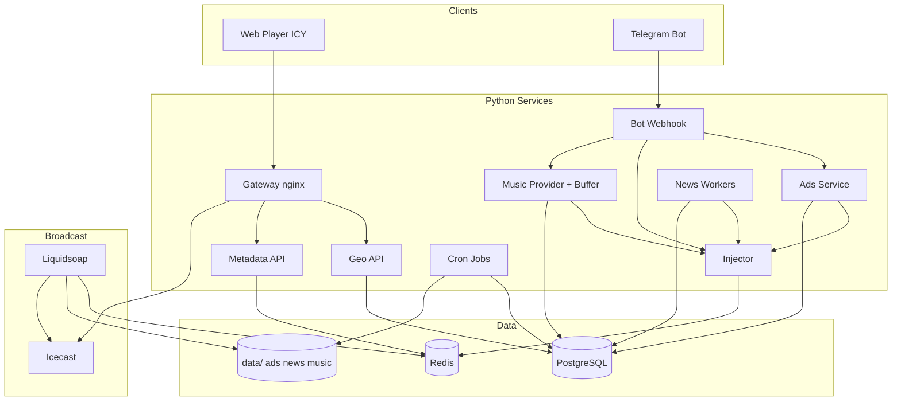

# Plan: FM21 Full Product (TZ v1.1)

## Summary

Implement the complete FM21 product from `docs/tz.md` v1.1: geotargeted synchronous internet radio with Yandex music buffer, 15-minute IT news (RSS → summarize → TTS), full Telegram operator control, PostgreSQL persistence, and production HTTPS deploy. Stack: **Liquidsoap + Icecast + Python 3.12 + PostgreSQL + Redis + Docker**. Supersedes thin U9–U11 outlines in greenfield plan `001`.

**Already done (Phase 0):** U1–U3 — strategy, ADRs, contracts, acceptance spec, OpenAPI stubs.

---

## Problem Frame

Greenfield plan `001` intentionally stopped at geo proof (U4–U8). TZ §12 acceptance requires music, news, full bot, and production ops. This plan provides **implementation-ready units** (Goal, Files, Approach, Test scenarios, Verification) for every remaining capability.

---

## Requirements

From `docs/brainstorms/2026-06-08-fm21-full-product-requirements.md`:

| Phase | Requirements |
|-------|----------------|
| 1 | R1–R4, R5–R6 (partial), R9, R11–R17, R30–R31 (partial) |
| 2 | R5, R10, R23–R26, R34–R35 (music subset) |
| 3 | R5, R7–R8, R18–R22, R34–R36 (news) |
| 4 | R27–R29, R30, R32 |
| 5 | R37–R40, R36 (cron prod) |

---

## Key Technical Decisions

| ID | Decision | Rationale |
|----|----------|-----------|
| KTD-F1 | **ICY + Icecast mount** per city | Sync radio; TZ HLS/WS superseded (ADR-001) |
| KTD-F2 | **Python 3.12** glue services | TZ Node layout superseded; Telegram/ffmpeg ecosystem |
| KTD-F3 | **PostgreSQL 16** all TZ §8.1 tables | Single DB introduced in U9 before music/news |
| KTD-F4 | **Priority dequeue** via LRANGE+LREM script | Mixed-type Redis list; not blind RPOP at scale |
| KTD-F5 | **News: RSS registry + OpenAI + Neurozvuk** | TZ §3.1; search API optional fallback |
| KTD-F6 | **Ads service** separate from bot | Transcode + DB + enqueue; bot stays thin |
| KTD-F7 | **`playlist_rules.yaml`** policy seam | R24; replaces `playlist-rules.js` |
| KTD-F8 | **Production in `deploy/`** | ADR-003; root Compose dev-only |
| KTD-F9 | **NEWS_PAIR** single enqueue | ADR-001 §9; TZ STINGER+NEWS merged |

---

## High-Level Technical Design



**Enqueue item shape** (canonical — `docs/contracts/broadcast-semantics.md`):

```json
{
  "id": "uuid",
  "type": "AD | NEWS_PAIR | MUSIC_ORDER | MUSIC",
  "priority": 100 | 80 | 50 | 10,
  "uri": "file:// or https://",
  "city_tag": "moscow | spb | all",
  "enqueued_at": "ISO8601",
  "meta": { "title": "", "artist": "", "duration_sec": 0, "stinger_uri": "" }
}
```

---

## Phased Delivery

| Phase | Units | Outcome | TZ §11 mapping |
|-------|-------|---------|----------------|
| **0** | U1–U3 ✅ | Docs, contracts, acceptance | — |
| **1** | U4–U8 | Two-city ICY, geo, static bed, voice ads | Stages 1, 5 (ads only) |
| **2** | U9–U14 | Yandex music, buffer, priority dequeue, `/order` | Stages 2, 3 (server stream) |
| **3** | U15–U23 | Full news pipeline + NEWS_PAIR on air | Stage 4 |
| **4** | U24–U29 | Full bot, metadata API, multi-city | Stage 5 complete |
| **5** | U30–U34 | Production deploy, monitoring, cron | Stage 6 |

---

## Implementation Units

### Phase 1 — Foundation (U4–U8)

*Units U4–U8 are fully specified in `docs/plans/2026-06-08-001-feat-fm21-greenfield-plan.md`. Execute unchanged. Summary:*

| Unit | Goal |
|------|------|
| U4 | Docker: Liquidsoap + Icecast + Redis; static music bed; ICY mounts |
| U5 | Injector: `POST /internal/enqueue`, AD limits, `all` fan-out |
| U6 | Geo API: detect + reverse |
| U7 | Web player + metadata poll; FM21 UI |
| U8 | Telegram bot: voice ads (stubs `/order`, `/status`, `/playlist`) |

**Phase 1 exit:** AE1, AE4, AE6; TZ §12 partial (geo, ads, UI).

---

### U9. PostgreSQL schema (full TZ §8.1)

**Goal:** Add PostgreSQL to dev stack with all persistence tables before music and news workers.

**Requirements:** R34

**Dependencies:** U4

**Files:**
- `docker-compose.yml` (add `postgres`)
- `services/db/session.py`, `services/db/models.py`
- `services/db/migrations/001_initial.sql` (or Alembic `versions/001_initial.py`)
- `tests/test_db_schema.py`
- `.env.example` (`DATABASE_URL`)

**Approach:**
- Tables: `news_items`, `ads`, `tracks_cache`, `playlist_config`, `broadcast_log` per TZ §8.1 + columns from news brainstorm (status enum, content_hash, audit timestamps).
- Healthcheck on postgres; migrations on service start in dev.
- All glue services use async SQLAlchemy 2.x or asyncpg pool.

**Test scenarios:**
- Fresh migration applies; re-run idempotent.
- UNIQUE constraints on `news_items.source_url`, `content_hash`.
- Round-trip CRUD on each table.

**Verification:** `docker compose run --rm test pytest tests/test_db_schema.py`; `\d` shows all tables.

---

### U10. Yandex MusicProvider

**Goal:** Server-side Yandex adapter behind `MusicProvider` interface.

**Requirements:** R23, ADR-002

**Dependencies:** U9

**Files:**
- `services/music/provider.py`, `yandex_provider.py`, `yandex_auth.py`, `static_provider.py`
- `tests/test_yandex_provider.py`, `tests/fixtures/yandex/`
- `docs/adr/002-music-licensing.md` (implementation appendix)

**Approach:**
- Methods: `search`, `get_playlist_tracks`, `resolve_stream_url` with expiry.
- Cache stream URLs in `tracks_cache`; refresh when `< 2 min` to expiry.
- `MUSIC_PROVIDER=yandex|static` factory; token from env only.
- `StaticProvider` reads `data/music/static/` for fallback.

**Test scenarios:**
- Mocked search returns ranked tracks.
- Expired URL triggers re-resolve.
- Invalid token → `ProviderUnavailable` → static fallback.

**Verification:** Unit tests pass; resolved URL reachable from Liquidsoap container network.

---

### U11. Playlist rules loader

**Goal:** Developer-editable `playlist_rules.yaml`; per-city overrides in DB; admin `/playlist` writes DB.

**Requirements:** R24, R26, R31

**Dependencies:** U9, U10

**Files:**
- `services/music/playlist_rules.yaml`
- `services/music/rules_loader.py`, `rules_schema.py`, `config_service.py`
- `tests/test_playlist_rules.py`

**Approach:**
- YAML: default Yandex playlist IDs, `max_track_duration_sec`, blocklists, per-city overrides.
- Merge YAML with `playlist_config` row when DB `updated_at` newer.
- Boot validation — invalid YAML fails fast.

**Test scenarios:**
- City override selects different playlist.
- Blocklisted artist filtered.
- Malformed YAML → startup error.

**Verification:** Changing YAML only alters candidates after worker restart; no Liquidsoap edits.

---

### U12. Music buffer worker

**Goal:** Maintain ≥ 10 `MUSIC` items per city in Redis.

**Requirements:** R10, R35

**Dependencies:** U5, U10, U11

**Files:**
- `services/music/buffer_worker.py`, `enqueue.py`
- `docker/music-worker.Dockerfile`
- `docker-compose.yml` (add `music-worker`)
- `tests/test_buffer_worker.py`

**Approach:**
- Poll each active city; count `MUSIC` in queue via scan; fill to 10.
- Resolve stream URL at enqueue; `meta.title`, `meta.artist`, `meta.duration_sec`.
- Dedupe recent plays via `broadcast_log` / `fm21:playlist:buffer:{cityTag}`.
- Yandex down → enqueue static `file://` MUSIC items.

**Test scenarios:**
- Empty queue → 10 items within 60s.
- Consumption replenishes.
- Provider failure → static fallback items present.

**Verification:** Steady-state ≥ 10 MUSIC per city; pytest green.

---

### U13. Liquidsoap priority dequeue + NEWS_PAIR hook

**Goal:** Priority-aware dequeue for AD, MUSIC_ORDER, MUSIC, NEWS_PAIR; play HTTPS Yandex URIs.

**Requirements:** R5, R6

**Dependencies:** U12, U4

**Files:**
- `broadcast/liquidsoap/fm21.liq`
- `broadcast/liquidsoap/dequeue.lua` (or `dequeue.sh`)
- `tests/test_dequeue_priority.py`

**Approach:**
- LRANGE → pick highest priority, FIFO within tier → LREM.
- NEWS_PAIR: play `meta.stinger_uri` then `uri` without intermediate dequeue.
- 2s crossfade; static bed only when queue empty.
- Update `fm21:current:{cityTag}` on block start.
- HTTP URL 403 at play → skip within 5s dead-air budget.

**Test scenarios:**
- AD before MUSIC in mixed queue.
- NEWS_PAIR atomic play sequence in logs.
- FIFO within same priority.

**Verification:** `test_dequeue_priority.py`; manual listen Yandex tracks between ads.

---

### U14. Bot `/order` activation

**Goal:** `/order Title — Artist` → search → confirm → MUSIC_ORDER enqueue.

**Requirements:** R25, R28, AE7

**Dependencies:** U10, U11, U13, U8

**Files:**
- `services/bot/handlers/order.py`, `parsers/order.py`
- `services/bot/clients/injector_client.py`, `music_client.py`
- `tests/test_bot_order.py`

**Approach:**
- Parse `—` separator; top 3 inline matches; confirm before enqueue.
- Uses operator `city_tag` from prefs (U24 may add persistence; use in-memory default until then).
- Remove U8 stub message for `/order`.

**Test scenarios:**
- Happy path → MUSIC_ORDER on operator city only.
- No results → friendly error.
- Order during playback → after current block.

**Verification:** pytest; manual order audible on correct mount.

**Phase 2 exit:** TZ §12 music + partial bot; R10 satisfied.

---

### U15. News DB models & migrations

**Goal:** `news_items` workflow states and repository API.

**Requirements:** R18, R34

**Dependencies:** U9

**Files:**
- `services/news/db/models.py`, `repository.py`
- `services/db/migrations/002_news_indexes.py`
- `tests/test_news_repository.py`

**Approach:**
- Status: `fetched` → `summarized` → `voiced` → `ready` | `failed`.
- Repository: create from fetch, update summary/audio, increment play_count.

**Test scenarios:**
- State transitions; play_count increment once per air slot.

**Verification:** pytest; migration applies on top of U9 schema.

---

### U16. RSS ingest & source registry

**Goal:** Continuous IT news ingest from configured feeds.

**Requirements:** R18

**Dependencies:** U15

**Files:**
- `services/news/sources.yaml`
- `services/news/fetcher/rss.py`, `normalize.py`, `dedup.py`
- `services/news/workers/fetch_cron.py`
- `docker/news.Dockerfile`, `docker-compose.yml` (`news-fetch`, `*/10 * * * *`)
- `tests/fixtures/feeds/`, `tests/test_news_fetcher.py`

**Approach:**
- Registry: per-source `enabled`, `weight`, `url`; human-maintained.
- Tier 1: HN, TechCrunch, Verge, Ars, Habr; Tier 2/3 optional search fallback (ADR-004).
- URL normalize + UNIQUE `source_url`; `content_hash` for syndication.
- Article body fetch when RSS snippet < 500 chars.

**Test scenarios:**
- Fixture RSS → rows created.
- Duplicate URL → no second row.
- utm_ stripped from URL dedup.

**Verification:** pytest; manual fetch increases `status=fetched` count.

---

### U17. Summarizer (OpenAI)

**Goal:** RU 150–250 word radio copy from source text.

**Requirements:** R19, R22

**Dependencies:** U15, U16

**Files:**
- `services/news/summarizer/prompt.py`, `openai_client.py`, `validate.py`
- `services/news/workers/summarize.py`
- `tests/test_news_summarizer.py`

**Approach:**
- Prompt: IT tone, no bullet lists, word count enforced with retry.
- Idempotent on already-summarized rows.

**Test scenarios:**
- Mock 180 words → accepted.
- Out of range → retry once.

**Verification:** pytest; spot-check 3 Russian summaries.

---

### U18. TTS & audio storage

**Goal:** Neurozvuk MP3 + stinger asset + duration probe.

**Requirements:** R20

**Dependencies:** U17

**Files:**
- `services/news/tts/neurozvuk.py`
- `services/news/storage/local.py`, `storage/s3.py`
- `services/news/audio_probe.py`
- `data/news/news-stinger.mp3`
- `tests/test_news_tts.py`

**Approach:**
- TTS cache key `fm21:tts:cache:{sha256(summary_ru)}` in Redis.
- Output `file:///data/news/{id}.mp3` (dev) or S3 (prod — ADR-008).
- ffprobe duration; stinger 3–5s committed asset.

**Test scenarios:**
- Mock TTS → file + `audio_url` + duration.
- Repeat text → no second TTS call.

**Verification:** pytest; stinger duration in [3,5]s.

---

### U19. Selection & play-count

**Goal:** Select eligible news; play_count ≤ 3 / 24h; Redis mirror.

**Requirements:** R8

**Dependencies:** U18

**Files:**
- `services/news/selection.py`, `play_count.py`
- `services/news/workers/play_count_reset.py` (`0 0 * * *`)
- `tests/test_news_selection.py`, `tests/test_news_play_count.py`

**Approach:**
- Select `ready` with `play_count < 3`; rotate by `last_played_at ASC NULLS FIRST`.
- Redis `INCR fm21:news:played:{content_hash}` TTL 86400.
- Increment once per slot (global per item, all cities share audio).

**Test scenarios:**
- AE3: item at cap skipped when alternatives exist.
- Repeat uses existing `audio_url`, TTS mock call count 0.

**Verification:** pytest AE3 paths; redis-check.

---

### U20. Materialize worker (T−2 min)

**Goal:** Pre-generate summary + audio before slot.

**Requirements:** R22

**Dependencies:** U17, U18, U19

**Files:**
- `services/news/workers/materialize_cron.py` (`2,17,32,47 * * * *`)
- `services/news/pipeline.py`, `slot_clock.py`
- `tests/test_news_materialize.py`

**Approach:**
- Pin selected item in `fm21:news:slot:{slot_iso}:item_id` TTL 30m.
- Pipeline: select → summarize if needed → TTS if needed → `ready`.

**Test scenarios:**
- `fetched` only at T−2 → `ready` before enqueue cron.
- Already `ready` → no API calls.

**Verification:** integration timing test; pytest.

---

### U21. News slot scheduler & enqueue

**Goal:** `*/15` NEWS_PAIR to all cities via injector.

**Requirements:** R7, R21

**Dependencies:** U19, U20, U5

**Files:**
- `services/news/workers/enqueue_cron.py`
- `services/news/enqueue.py`
- `services/injector/validation.py` (accept NEWS_PAIR)
- `tests/test_news_enqueue.py`

**Approach:**
- Build NEWS_PAIR JSON with `stinger_uri` in meta.
- Fan-out per `cities.yaml`; 10-minute max slip then skip+log.
- Increment play_count after all cities accepted.

**Test scenarios:**
- 2 cities → 2 queue items, one play_count increment.
- Slip +11m → skip.

**Verification:** pytest; manual stinger+news on mount.

---

### U22. Liquidsoap NEWS_PAIR playback hardening

**Goal:** AE2 — ads wait for NEWS_PAIR block; atomic stinger+news.

**Requirements:** R6, R7

**Dependencies:** U13, U21

**Files:**
- `broadcast/liquidsoap/fm21.liq` (NEWS_PAIR sequence)
- `tests/test_injector.py` (AE2 scenarios)
- `spec/acceptance.yaml` (undefferr AE2)

**Approach:**
- Single block dequeue; nested play stinger → news.
- AD enqueued mid-pair stays pending until block end.

**Test scenarios:**
- AE2 manual + simulated queue order.

**Verification:** AE2 acceptance green; injector tests updated.

---

### U23. News metadata & acceptance closure

**Goal:** Player/bot show news type; AE3 fully wired.

**Requirements:** R14, R29

**Dependencies:** U7, U21, U22

**Files:**
- `services/metadata/main.py`
- `services/bot/handlers/status.py` (partial — news countdown)
- `spec/acceptance.yaml` (undefferr AE3)
- `tests/test_metadata_news.py`
- `tests/e2e/news-slot.spec.ts` (optional)

**Approach:**
- `content_type: news` in now-playing.
- `next_news_at` from slot clock.

**Verification:** AE3 automated; news label in player during NEWS_PAIR.

**Phase 3 exit:** TZ §12 news criteria; AE2, AE3.

---

### U24. Ads service extraction

**Goal:** Dedicated ads module: transcode, DB, enqueue (TZ §3.3).

**Requirements:** R27

**Dependencies:** U9, U5, U8

**Files:**
- `services/ads/transcode.py`, `service.py`, `main.py`, `routes.py`
- `docker/ads.Dockerfile`
- `services/bot/clients/ads_client.py`
- `tests/test_ads_service.py`, `tests/test_ads_transcode.py`
- Remove direct bot→injector for ads

**Approach:**
- `POST /internal/ads/submit`; 60s limit; EBU R128; DB `ads` row lifecycle.
- Bot calls ads service only after city confirmation.

**Test scenarios:**
- 61s rejected; 6th ad 409; `all` fan-out.

**Verification:** pytest; AE1 still holds.

---

### U25. Operator `/city` & auth

**Goal:** Persist operator default city; allowlists.

**Requirements:** R28

**Dependencies:** U9, U8

**Files:**
- `services/bot/handlers/city.py`, `middleware/auth.py`, `keyboards.py`
- `services/bot/storage/operator_prefs.py`
- `tests/test_bot_city.py`

**Approach:**
- `/city <tag>`, `/city all`; `TELEGRAM_OPERATOR_IDS`, `TELEGRAM_ADMIN_IDS`.
- Voice keyboard from `cities.yaml`.

**Verification:** pytest; persistence across bot restart.

---

### U26. Voice ad flow (production)

**Goal:** Full confirmation flow; migrate U8 to ads service.

**Requirements:** R27, R28, AE7

**Dependencies:** U24, U25

**Files:**
- `services/bot/handlers/voice.py`, `conversation.py`
- `tests/test_bot_voice_flow.py`

**Approach:**
- Mandatory inline confirm; stale callback ignored; 10m state expiry.

**Verification:** AE1 manual; pytest flow tests.

---

### U27. Bot `/status` & `/playlist` admin

**Goal:** Complete operator commands per TZ §3.4.

**Requirements:** R26, R29, AE7

**Dependencies:** U25, U28, U11

**Files:**
- `services/bot/handlers/status.py`, `playlist.py`, `auth.py`
- `tests/test_bot_status.py`, `tests/test_bot_playlist.py`
- `docs/contracts/operator-contract.md` (mark implemented)

**Approach:**
- `/status` via metadata client; `/playlist` admin-only updates `playlist_config`.

**Verification:** pytest; `/status` matches Redis queue.

---

### U28. Metadata API — queue preview

**Goal:** `GET /api/queue/{cityTag}` next 5 items; `remaining_sec` on now-playing.

**Requirements:** R30, R14

**Dependencies:** U13, U7

**Files:**
- `services/metadata/queue_reader.py`, `now_playing.py`
- `docs/openapi.yaml`
- `tests/test_metadata.py`

**Approach:**
- Priority sort pending queue; public responses per listener contract.

**Verification:** OpenAPI examples match curl; pytest.

---

### U29. Multi-city operations

**Goal:** N cities from `cities.yaml` without code changes.

**Requirements:** R37

**Dependencies:** U6, U25, U28

**Files:**
- `broadcast/liquidsoap/cities.yaml` (template third city)
- `services/geo/city_names.py`
- `services/injector/validation.py`
- `tests/test_multi_city.py`
- `deploy/README.md` §adding a city

**Verification:** Three mounts stream; ekb ad isolated from moscow.

---

### U30. Production deploy & HTTPS webhook

**Goal:** `deploy/production/` manifests; TLS; Telegram webhook.

**Requirements:** R38, R40

**Dependencies:** U4–U29

**Files:**
- `deploy/production/` (compose-prod or k8s stubs)
- `deploy/production/gateway/nginx.conf`
- `deploy/production/env.template`
- `scripts/set_telegram_webhook.sh`
- `services/bot/webhook.py` (secret token validation)

**Approach:**
- Gateway terminates TLS; proxies `/api/bot/webhook`, `/api/*`, static `web/`.
- Icecast source password via secrets.
- Document rollback procedure.

**Verification:** Staging smoke; `getWebhookInfo` correct; voice ad E2E on staging.

---

### U31. Monitoring & health

**Goal:** Deep internal health; metrics; runbooks.

**Requirements:** R39

**Dependencies:** U30

**Files:**
- `services/metadata/health.py`
- `services/common/logging.py` (JSON)
- `deploy/monitoring/prometheus.yml`, `alerts.yml` (optional)
- `docs/runbooks/stream-down.md`
- `tests/test_health.py`

**Approach:**
- Public `/api/health` minimal; `/internal/health` Redis+PG+Icecast+Liquidsoap.
- Metrics: listeners, queue depth, injector errors.

**Verification:** Degraded state when Redis down; runbook walkthrough.

---

### U32. Cron — cleanup & maintenance

**Goal:** TZ §9 cron jobs in production.

**Requirements:** R36

**Dependencies:** U9, U13, U18

**Files:**
- `services/cron/cleanup_ads.py`, `cleanup_tracks.py`, `news_cache_reset.py`, `scheduler.py`
- `docker/cron.Dockerfile`
- `deploy/production/cron-schedule`
- `tests/test_cron_cleanup.py`

**Approach:**
| Job | Schedule |
|-----|----------|
| cache-cleanup | `0 3 * * *` |
| news-cache-reset | `0 0 * * *` |
| playlist-refresh | `0 * * * *` (delegate to music worker if redundant) |

**Verification:** pytest with frozen time; manual `--once` run in dev.

---

### U33. Gateway production hardening

**Goal:** Rate limits on geo + webhook; CORS; static caching.

**Requirements:** R39 (operator contract deferred limits)

**Dependencies:** U30

**Files:**
- `deploy/production/gateway/nginx.conf` (limit_req)
- `docker/gateway.Dockerfile`

**Approach:**
- nginx `limit_req` on `/api/geo/*` and `/api/bot/webhook`.
- Per-operator daily ad cap optional (config flag).

**Verification:** Load test returns 429 over threshold.

---

### U34. End-to-end acceptance & TZ §12 sign-off

**Goal:** All acceptance criteria verifiable; update deferred flags in `spec/acceptance.yaml`.

**Requirements:** AE1–AE9, TZ §12

**Dependencies:** U30–U33

**Files:**
- `spec/acceptance.yaml`
- `tests/e2e/full-product.spec.ts`
- `README.md` (production quickstart)

**Approach:**
- Checklist mapping each TZ §12 row to test command.
- Undefferr AE2, AE3; add AE7–AE9 if missing.

**Verification:** Full checklist green on staging before prod cutover.

**Phase 5 exit:** Production-ready per TZ §11 stage 6.

---

## Scope Boundaries

### Deferred to Follow-Up Work

- Commercial music license (ADR-002 public launch)
- HLS adaptive streaming
- Web admin dashboard
- Near-duplicate news detection (SimHash) beyond URL/title hash

### Outside scope

- Agent workflow / `AGENTS.md` changes (human)
- Listener authentication

---

## Acceptance Examples (TZ §12 traceability)

| TZ §12 row | Units |
|------------|-------|
| Геотаргетинг | U5, U8, U24–U26, U29 |
| Веб-клиент | U7, R17 |
| Фон | U7, AE6 |
| Новости | U15–U23 |
| Музыка | U10–U14 |
| Объявления | U24–U26 |
| Бот | U8, U14, U25–U27 |
| Очередь | U5, U13, U22 |
| Интеграции | U10, U18, U30 |

---

## Risks & Dependencies

| Risk | Mitigation |
|------|------------|
| Yandex API breakage | MusicProvider + static fallback (U10, U12) |
| TTS latency at slot | Materialize T−2 min (U20) |
| Liquidsoap priority dequeue bugs | `test_dequeue_priority.py` (U13) |
| Music licensing public launch | ADR-002; closed beta scope |
| Telegram webhook TLS | U30 staging first |

**Human-only:** `docs/adr/004+`, `services/news/sources.yaml` production list, `.env` secrets, production `cities.yaml`.

---

## Open Questions (planning-time)

| Question | Resolution |
|----------|------------|
| News cron timezone | Default UTC; ADR-010 if Europe/Moscow required |
| Prod orchestrator | U30 documents single-VM vs K8s; images stay agnostic |
| S3 vs local news audio | ADR-008 before U30 prod cutover |

---

## ADRs to author (before implementation)

| ADR | Topic | Before unit |
|-----|-------|-------------|
| ADR-004 | News sourcing & attribution | U16 |
| ADR-005 | PostgreSQL adoption (if not folded into U9 notes) | U9 |
| ADR-006 | TTS provider (Neurozvuk) | U18 |
| ADR-007 | News play-count semantics | U19 |
| ADR-008 | News audio storage dev/prod | U18 |
| ADR-009 | LLM summarization policy | U17 |
| ADR-010 | News slot timezone & slip | U21 |

---

## Sources

- `docs/tz.md` v1.1
- `docs/brainstorms/2026-06-08-fm21-full-product-requirements.md`
- `docs/plans/2026-06-08-001-feat-fm21-greenfield-plan.md` (U4–U8 detail)
- `docs/adr/001-delivery-model.md`, `002`, `003`
- `docs/contracts/`
